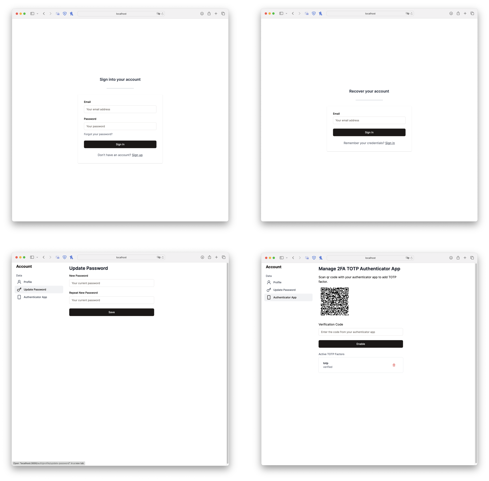

Supabase Auth Self Service UI (SASS)
===
User interface for all Supabase Auth flows (login, registration, account settings, account recovery, account verification).



### Usage
SASS is intended to be used as is (customization allowed with configuration options) on a subdirectory (e.g. https://exaple.com/auth) or a subdomain (e.g. https://accounts.example.com).

To run it locally please see [docker-compose.yml](./docker-compose.yml).

### Development
First copy sample environment variables file:
```bash
cp .env.local-sample .env-local
```

Set up Supabase access url and keys in `.env-local`.

Development requires [Node.js](https://nodejs.org) 20.

```bash
# install dependencies
$ npm i
# run next application in dev mode
$ npm run dev
```